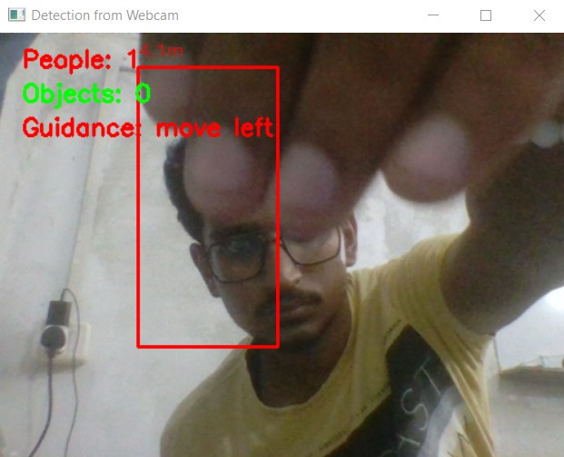
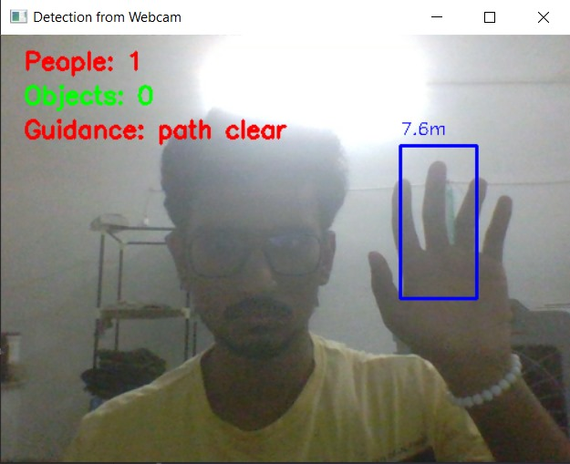

# VisionGuard: AI-Powered Obstacle Detection & Navigation System for the Visually Impaired

A real-time assistive system that leverages computer vision and audio feedback to help visually impaired individuals navigate their environment safely.

## Project Overview

VisionGuard is an AI-powered navigation system that combines object and people detection with audio-based guidance. Built using Python, OpenCV, Flask, and gTTS, it provides real-time feedback to users about their surroundings. The system is particularly useful for visually impaired individuals, enhancing their situational awareness and helping avoid obstacles.

## Features

- Real-time video processing from a webcam
- People detection using HOG + SVM
- Object detection using Haar Cascade classifiers
- Distance estimation based on bounding box height
- Audio feedback using Google Text-to-Speech (gTTS)
- Web interface with Flask for video streaming and alerts
- Asynchronous and non-blocking audio playback using pygame
- Multi-threaded design for smooth performance

## System Architecture

1. *Video Input*: Captured via webcam.
2. *Detection Module*:
   - HOG for detecting people
   - Haar Cascades for detecting objects
3. *Distance Estimation*:
   - Uses known object height and camera parameters
4. *Guidance Logic*:
   - Divides frame into zones (left, center, right)
   - Provides direction suggestions (e.g., move left/right)
5. *Audio Feedback*:
   - Contextual and repeated instructions via gTTS and pygame
6. *Flask Web Interface*:
   - Streams video with bounding boxes and displays alerts

## Installation

### Prerequisites

- Python 3.6 or above
- Webcam connected to the system
- Internet connection (for gTTS)
- Required Python libraries

 ### Setup

1. Clone the repository or download the source code.
2. Install the required dependencies:

## Implementation

### Detection

- *People Detection*: Implemented using OpenCV’s HOGDescriptor with a pre-trained SVM classifier.
- *Object Detection*: Uses Haar Cascade classifiers for upper-body detection on grayscale frames.

### Distance Estimation

- Distance is estimated using the formula:Distance = (Known Height × Focal Length) / Pixel Height
- Constants:
- Person height = 1.7 m
- Object height = 0.5 m
- Focal length = 600 pixels (approximated)

### Audio Feedback

- *Text-to-Speech*: Google gTTS generates MP3 audio from guidance text.
- *Playback*: Pygame plays audio asynchronously using threading to avoid blocking detection.
- *Message Management*: Ensures no overlap and prioritizes urgent guidance.

### Flask Web Interface

- Two routes:
- /home: Displays the home page
- /webcam: Streams the webcam feed with bounding boxes and guidance
- UI displays:
- Bounding boxes with distance in meters
- Count of detected people and objects
- Current audio guidance message

### Guidance Logic

- Frame is divided into three zones: left, center, right.
- Based on detected positions and distances:
- Issues direction (move left/right)
- Warns when obstacles are too close
- Repeats guidance every 2 seconds for reinforcement

## Installation

### Prerequisites

- Python 3.6 or above
- Webcam connected to the system
- Internet connection (for gTTS)
- Required Python libraries
### Display Output:

- Design a user-friendly interface to display classification results on a connected display.
- Present captured images along with predicted digits and confidence scores for improved usability.

<table>
  <tr>
    <td>
      
    </td>
    <td>
      
    </td>
  </tr>
</table>
